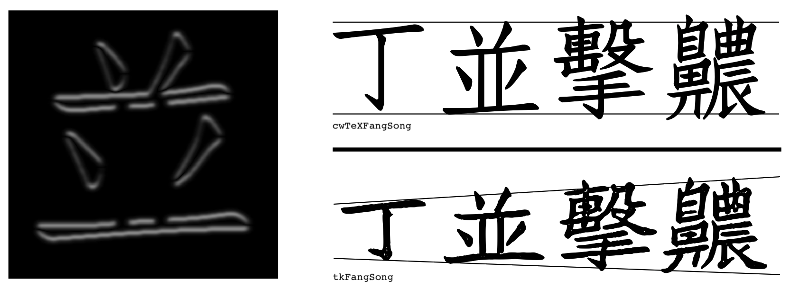

An experimental Fang Song style Chinese font generated with [skeleton-tracing](https://github.com/LingDong-/skeleton-tracing) and [pix2pix](https://github.com/affinelayer/pix2pix-tensorflow), with glyphs based on [cwTeXFangSong](https://github.com/l10n-tw/cwtex-q-fonts). The font is optimised for vertical typesetting. Below is a sample:

The font contains roughly 13,000 glyphs, mostly for traditional Chinese.

I created the font for one of my own projects. The font is admittedly not perfect, but nevertheless have many ineteresting features; therefore I am sharing the font file and programs used to generate it.

## [Download](dist/tkFangSong.ttf)

Download the font directly at [dist/tkFangSong.ttf](dist/tkFangSong.ttf). 

The name of the font is 剔骨仿宋 (thek-kwot-fang-song, So named because the algorithm that created it resembles "deboning"). It is licensed under [SIL open font license](LICENSE). If you wish to credit the author, you might use my name 黃令東/黄令东, or the romanization "Lingdong Huang".

## Features

The font builds on the elegant shapes from cwTeXFangSong to add more hand-made look and feel reminiscent of the aesthetics of old woodblock printed books.

The font has a wider proportion compared to the original cwTeXFangSong, and is further widened towards the bottom, to accentuate the finishing strokes. The "center of mass" is also moved downwards:

Above right is a visualization of the base function used to warp the skeleton.

The height of a glyph is additionally tweaked based on its vertical complexity, computed with [Sobel operator](https://en.wikipedia.org/wiki/Sobel_operator) and taking the max of each pixel row.

Many fonts are optimized for horizontal typesetting, and as such, when arranged vertically, the center of mass shifts left and right, giving a jagged look. This font attempts to solve the problem by computing centroids (via image moments) and aligning them.

The font has rich textures. Some of them are artifacts produced by pix2pix network; others are fine-tuned noises delibrately added.

It is to be noted that, as an automated process, it doesn't always produce optimal results; some characters might end up looking ugly, or use the wrong caligraphic movement for certain strokes; For some caligraphers, some strokes might appear too "weak" to their tastes.

## Process

The medial axis (skeleton) is computed for each raster rendering of the glyphs in the original font. (The resultant hershey font can be found at ./dist/CWFS64J.HF.TXT)

Pairs of images: the original rendering vs the skeletons are sent to pix2pix for training. pix2pix learns the correspondance and becomes capable of turning skeletons to glyphs.

New skeletons are generated by warping the originals according to my (questionable) taste.

All the new skeletons are fed into the trained network to obtain the new glyphs. The new glyphs are warped in structure, but the weight and shape of the strokes still look legit.

Some post-processing is applied, and [potrace](http://potrace.sourceforge.net/) is used to re-vectorize the glyphs. Finally, [fontforge](https://fontforge.org/en-US/) is used to create a TTF file.

## Building the font

Note that to use the font, you can simply [download it here](dist/tkFangSong.ttf). This sections is for reproducing the results from scratch.

The scripts used to build the font are included in the `workflow/` folder. Note that making the font is a quite involved process (especially the part of training the neural net). You might also need to modify the scripts to fit your system/folder configuration, but here are some rough steps:

- Get OpenCV, tensorflow<=1.13.1, numpy and friends
- First install swig version of [skeleton-tracing](https://github.com/LingDong-/skeleton-tracing) for python, then obtain cwTeXFangSong [from here](https://github.com/l10n-tw/cwtex-q-fonts-TTFs).
- Run `skel.py > CWFS64.HF.TXT`, then `join.py > CWFS64J.HF.TXT`
- Modify `pairs.py` to read `CWFS64J.HF.TXT` and output to a folder you will create.
- Download [pix2pix-tensorflow](https://github.com/affinelayer/pix2pix-tensorflow) and train on the images created in the previous step. (Good luck getting a prehistoric tensorflow project running, you'll need it. Once you do it's pretty straightforward, follow their README)
- I trained 40K steps on 1.3K images, afterwhich the quality didn't seem to improve much, your mileage might vary.
- Run `warp.py > CWFS64W3.HF.TXT`. Modify `pairs.py` to read from it, and create an output folder like before. Run `pairs.py`.
- Evaluate the new image pairs with pix2pix. Edit any of the images that have too much defect with Photoshop or software of your choice. Put the edited ones in a separated folder, say `retouched/`.
- Modify `refine.py` to read from the images and retouched images folders, create an output folder `fine/` for it, and run the script.
- Download [potrace](http://potrace.sourceforge.net/), make it runnable from commandline, and run `trace_all.py`.
- Run `forgefont.py` to create a TTF from SVGs generated in the previous step.
- Done! You can also preview the glyphs with `preview.py > index.html`, or preview the skeleton with `preview_hf.py > index.html`.

---

A PDF containing all the glyphs can be found [here](dist/catalog.pdf). If you find this font not bad, you might also enjoy [qiji-font](https://github.com/LingDong-/qiji-font), a more authentic reproduction of a historical typeface.